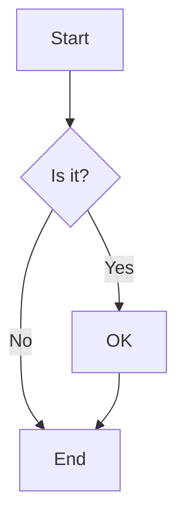
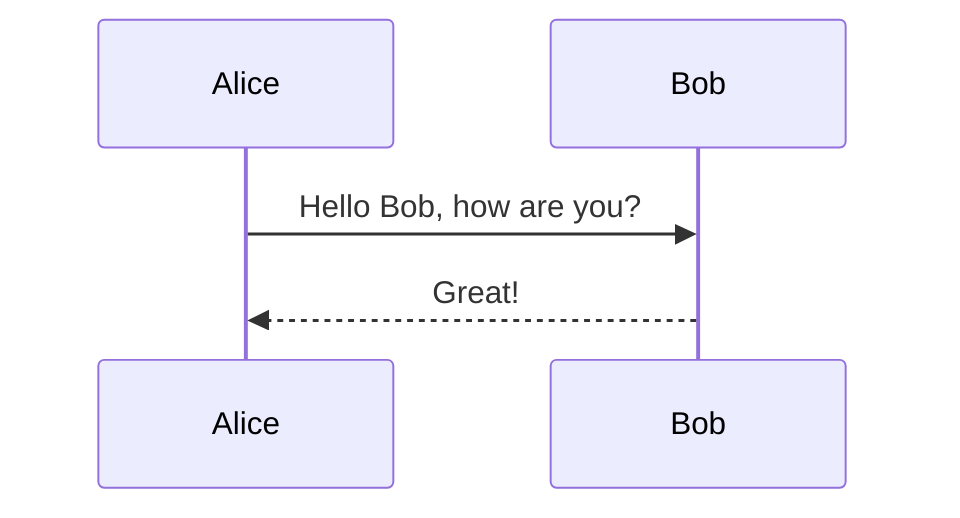
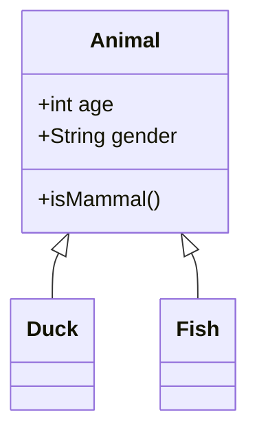

# API Documentation

## Overview

This document describes the REST API endpoints provided by the Mermaid Backend service. The backend is an optimized API for rendering Mermaid diagrams into various formats (SVG, PNG, PDF).

**Base URL:** `http://localhost:8096`

**Version:** 1.0.0

---

## Table of Contents

- [Authentication](#authentication)
- [Endpoints](#endpoints)
  - [POST /api/generate](#post-apigenerate)
  - [GET /health](#get-health)
- [Data Models](#data-models)
- [Error Handling](#error-handling)
- [Performance Features](#performance-features)
- [Examples](#examples)

---

## Authentication

Currently, this API does not require authentication. It's designed to run locally or in a trusted network environment.

---

## Endpoints

### POST /api/generate

Renders a Mermaid diagram and returns it in the requested format.

#### Request

**URL:** `/api/generate`

**Method:** `POST`

**Headers:**
```
Content-Type: application/json
```

**Body Parameters:**

| Parameter | Type | Required | Description |
|-----------|------|----------|-------------|
| `code` | string | Yes | The Mermaid diagram code to render |
| `format` | string | No | Output format: `svg`, `png`, or `pdf`. Default: `svg` |
| `backgroundColor` | string | No | Background color (hex or CSS color name). Default: `transparent` |
| `theme` | string | No | Mermaid theme: `default`, `dark`, `forest`, `neutral`. Default: `default` |
| `width` | number | No | Output width in pixels (for PNG/PDF). Default: `800` |
| `height` | number | No | Output height in pixels (for PNG/PDF). Default: `600` |

**Example Request:**

```json
{
  "code": "graph TD\n    A[Start] --> B[Process]\n    B --> C[End]",
  "format": "png",
  "backgroundColor": "white",
  "theme": "default",
  "width": 1024,
  "height": 768
}
```

#### Response

**Success Response (200 OK):**

Returns the rendered diagram as a binary file.

**Headers:**
- `Content-Type`: 
  - `image/svg+xml` for SVG format
  - `image/png` for PNG format
  - `application/pdf` for PDF format
- `Content-Disposition`: `inline; filename="diagram.{format}"`
- `X-Render-Time`: Time taken to render the diagram in milliseconds

**Body:** Binary data of the rendered diagram

**Example Response Headers:**
```
HTTP/1.1 200 OK
Content-Type: image/png
Content-Disposition: inline; filename="diagram.png"
X-Render-Time: 245
Content-Length: 45678
```

#### Error Responses

**400 Bad Request:**
```json
{
  "error": "Missing required parameter: code"
}
```

**500 Internal Server Error:**
```json
{
  "error": "Failed to render diagram: Invalid syntax"
}
```

---

### GET /health

Health check endpoint to verify the service status and monitor system resources.

#### Request

**URL:** `/health`

**Method:** `GET`

**Headers:** None required

#### Response

**Success Response (200 OK):**

```json
{
  "status": "ok",
  "browser": "connected",
  "pool": {
    "ready": true,
    "size": 5,
    "maxSize": 5
  },
  "uptime": 3600.5
}
```

**Response Fields:**

| Field | Type | Description |
|-------|------|-------------|
| `status` | string | Overall service status: `ok` or `error` |
| `browser` | string | Puppeteer browser connection status: `connected` or `disconnected` |
| `pool.ready` | boolean | Whether the page pool is initialized and ready |
| `pool.size` | number | Current number of pre-loaded pages in the pool |
| `pool.maxSize` | number | Maximum pool size configuration |
| `uptime` | number | Server uptime in seconds |

---

## Data Models

### Diagram Request

The main request object for rendering diagrams.

```typescript
interface DiagramRequest {
  code: string;              // Required: Mermaid diagram code
  format?: 'svg' | 'png' | 'pdf'; // Optional: Output format (default: 'svg')
  backgroundColor?: string;  // Optional: Background color (default: 'transparent')
  theme?: 'default' | 'dark' | 'forest' | 'neutral'; // Optional: Theme
  width?: number;            // Optional: Width in pixels (default: 800)
  height?: number;           // Optional: Height in pixels (default: 600)
}
```

### Health Response

The response structure for the health check endpoint.

```typescript
interface HealthResponse {
  status: 'ok' | 'error';
  browser: 'connected' | 'disconnected';
  pool: {
    ready: boolean;
    size: number;
    maxSize: number;
  };
  uptime: number;
}
```

### Error Response

Standard error response format.

```typescript
interface ErrorResponse {
  error: string;  // Human-readable error message
}
```

---

## Error Handling

The API uses standard HTTP status codes to indicate success or failure:

| Status Code | Description |
|-------------|-------------|
| 200 | Success - Diagram rendered successfully |
| 400 | Bad Request - Invalid parameters or malformed Mermaid code |
| 500 | Internal Server Error - Server-side error during rendering |

### Common Error Messages

| Error Message | Cause | Solution |
|---------------|-------|----------|
| `Missing required parameter: code` | The `code` field is not provided | Include Mermaid diagram code in the request |
| `Invalid format. Supported formats: svg, png, pdf` | Unsupported format specified | Use one of the supported formats |
| `Failed to render diagram: Invalid syntax` | Mermaid syntax error in the diagram code | Validate Mermaid syntax |
| `Browser not initialized` | Puppeteer browser failed to start | Restart the service |
| `Timeout: Rendering took too long` | Diagram is too complex or server is overloaded | Simplify the diagram or increase timeout |

---

## Performance Features

The backend includes several performance optimizations:

### 1. **Page Pool**
- Maintains a pool of 5 pre-loaded browser pages
- Eliminates cold-start delays
- First request is nearly instantaneous (~200-300ms)

### 2. **In-Memory Cache**
- Caches rendered diagrams in all formats
- Subsequent requests for the same diagram are instant
- Cache is cleared on server restart

### 3. **Browser Singleton**
- Single Puppeteer browser instance shared across all requests
- Reduces memory footprint and startup time

### 4. **Local Mermaid Library**
- Mermaid.js is loaded from local `node_modules`
- No CDN dependency or network latency
- Faster rendering compared to external CDN

### 5. **Request Interception**
- Blocks unnecessary network resources (fonts, images, ads)
- Reduces page load time significantly

### 6. **Multiple Rendering Strategies**

**SVG Rendering:**
- Direct SVG extraction from the DOM
- Fastest method, no image processing needed

**PNG Rendering:**
1. **ImageMagick** (Priority): Robust SVG → PNG conversion
2. **Sharp** (Fallback): Fast SVG → PNG conversion
3. **Puppeteer Screenshot** (Last Resort): Direct browser screenshot

**PDF Rendering:**
- Uses Puppeteer's built-in PDF generation
- Optimized for print quality

---

## Examples

### Example 1: Basic Flowchart (SVG)

**Request:**
```bash
curl -X POST http://localhost:8096/api/generate \
  -H "Content-Type: application/json" \
  -d '{
    "code": "graph TD\n    A[Start] --> B[Process]\n    B --> C[End]",
    "format": "svg"
  }' \
  --output diagram.svg
```

**Response:**
- SVG file saved as `diagram.svg`
- Typical render time: ~200-300ms (first request), ~50ms (cached)

---

### Example 2: Sequence Diagram (PNG)

**Request:**
```bash
curl -X POST http://localhost:8096/api/generate \
  -H "Content-Type: application/json" \
  -d '{
    "code": "sequenceDiagram\n    Alice->>Bob: Hello Bob!\n    Bob-->>Alice: Hi Alice!",
    "format": "png",
    "backgroundColor": "white",
    "width": 1024,
    "height": 768
  }' \
  --output diagram.png
```

**Response:**
- PNG file saved as `diagram.png`
- Typical render time: ~300-500ms (first request), ~100ms (cached)

---

### Example 3: Class Diagram (PDF)

**Request:**
```bash
curl -X POST http://localhost:8096/api/generate \
  -H "Content-Type: application/json" \
  -d '{
    "code": "classDiagram\n    Animal <|-- Duck\n    Animal <|-- Fish\n    Animal : +int age\n    Animal : +String gender\n    Animal: +isMammal()\n    class Duck{\n        +String beakColor\n        +swim()\n        +quack()\n    }",
    "format": "pdf",
    "theme": "dark"
  }' \
  --output diagram.pdf
```

**Response:**
- PDF file saved as `diagram.pdf`
- Typical render time: ~400-600ms (first request), ~150ms (cached)

---

### Example 4: Using from JavaScript/Node.js

```javascript
const fetch = require('node-fetch');
const fs = require('fs');

async function renderDiagram() {
  const response = await fetch('http://localhost:8096/api/generate', {
    method: 'POST',
    headers: {
      'Content-Type': 'application/json'
    },
    body: JSON.stringify({
      code: 'graph LR\n    A --> B\n    B --> C\n    C --> A',
      format: 'png',
      backgroundColor: 'transparent'
    })
  });

  if (response.ok) {
    const buffer = await response.buffer();
    fs.writeFileSync('output.png', buffer);
    console.log('Diagram saved as output.png');
    
    // Check render time
    const renderTime = response.headers.get('X-Render-Time');
    console.log(`Render time: ${renderTime}ms`);
  } else {
    const error = await response.json();
    console.error('Error:', error.error);
  }
}

renderDiagram();
```

---

### Example 5: Using from Frontend (React/Vue/Angular)

```javascript
async function renderDiagram(code, format = 'svg') {
  try {
    const response = await fetch('http://localhost:8096/api/generate', {
      method: 'POST',
      headers: {
        'Content-Type': 'application/json'
      },
      body: JSON.stringify({ code, format })
    });

    if (!response.ok) {
      const error = await response.json();
      throw new Error(error.error);
    }

    const blob = await response.blob();
    const url = URL.createObjectURL(blob);
    
    // Display in an  tag or download
    return url;
  } catch (error) {
    console.error('Failed to render diagram:', error.message);
    throw error;
  }
}

// Usage:
const diagramUrl = await renderDiagram('graph TD\n A-->B', 'png');
document.getElementById('diagram').src = diagramUrl;
```

---

### Example 6: Health Check

**Request:**
```bash
curl http://localhost:8096/health
```

**Response:**
```json
{
  "status": "ok",
  "browser": "connected",
  "pool": {
    "ready": true,
    "size": 5,
    "maxSize": 5
  },
  "uptime": 3600.5
}
```

---

### Example 7: Error Handling

**Request with Invalid Syntax:**
```bash
curl -X POST http://localhost:8096/api/generate \
  -H "Content-Type: application/json" \
  -d '{
    "code": "invalid mermaid syntax @#$%",
    "format": "svg"
  }'
```

**Response (500 Internal Server Error):**
```json
{
  "error": "Parse error on line 1: Unexpected character: @"
}
```

---

## Supported Diagram Types

The API supports all Mermaid diagram types:

1. **Flowchart** - `graph TD` / `graph LR`
2. **Sequence Diagram** - `sequenceDiagram`
3. **Class Diagram** - `classDiagram`
4. **State Diagram** - `stateDiagram-v2`
5. **Entity Relationship Diagram** - `erDiagram`
6. **User Journey** - `journey`
7. **Gantt Chart** - `gantt`
8. **Pie Chart** - `pie`
9. **Quadrant Chart** - `quadrantChart`
10. **Requirement Diagram** - `requirementDiagram`
11. **Git Graph** - `gitGraph`
12. **Mindmap** - `mindmap`
13. **Timeline** - `timeline`
14. **ZenUML** - `zenuml`
15. **Sankey** - `sankey`

For Mermaid syntax documentation, visit: https://mermaid.js.org/

---

## Technical Details

### Dependencies

- **Express** - Web framework
- **Puppeteer** - Headless browser for rendering
- **Mermaid.js** - Diagram rendering library
- **CORS** - Cross-origin resource sharing support
- **ImageMagick** - SVG to PNG conversion (optional, recommended)
- **Sharp** - Image processing library (fallback)

### System Requirements

- **Node.js**: >= 18.0.0
- **Memory**: Minimum 512MB RAM, recommended 1GB+
- **Disk Space**: ~500MB for Chrome binary and dependencies
- **OS**: Linux, macOS, or Windows

### Environment Variables

| Variable | Description | Default |
|----------|-------------|---------|
| `PORT` | Server port | `8096` |
| `MAX_POOL_SIZE` | Maximum number of pre-loaded pages | `5` |
| `CACHE_ENABLED` | Enable/disable in-memory cache | `true` |

### Resource Limits

- **Request Body Size**: 10MB max
- **Rendering Timeout**: 20 seconds (standard diagrams), 35 seconds (complex mindmaps)
- **Concurrent Requests**: Limited by pool size (5 concurrent renders)

---

## Troubleshooting

### Common Issues

**Issue: "Browser not initialized"**
- **Cause**: Puppeteer failed to launch Chrome
- **Solution**: 
  - Check Chrome dependencies are installed
  - On Linux: `sudo apt-get install -y chromium-browser`
  - Verify sufficient memory (minimum 512MB)

**Issue: "Pool not ready"**
- **Cause**: Page pool is still initializing
- **Solution**: Wait ~2-3 seconds after server startup for pool initialization

**Issue: "Rendering timeout"**
- **Cause**: Diagram is too complex or server is under heavy load
- **Solution**: 
  - Simplify the diagram
  - Increase server resources
  - Reduce concurrent requests

**Issue: PNG quality is poor**
- **Cause**: Using screenshot fallback instead of ImageMagick/Sharp
- **Solution**: 
  - Install ImageMagick: `sudo apt-get install imagemagick`
  - Or install Sharp: `npm install sharp`

---

## Rate Limiting

Currently, no rate limiting is implemented. For production use, consider:

- Adding rate limiting middleware (e.g., `express-rate-limit`)
- Implementing request queuing
- Using a reverse proxy (e.g., Nginx) with rate limiting

---

## CORS Configuration

CORS is enabled for all origins by default. To restrict origins in production:

```javascript
// In server.js
app.use(cors({
  origin: ['https://yourdomain.com', 'https://app.yourdomain.com'],
  methods: ['GET', 'POST'],
  allowedHeaders: ['Content-Type']
}));
```

---

## Monitoring & Logging

The service logs important events to console:

- **Startup**: Server initialization, pool status, Mermaid library loading
- **Requests**: Each render request with timing and cache status
- **Errors**: All errors with stack traces
- **Shutdown**: Graceful shutdown events

**Example Log Output:**
```
🚀 Backend Server running on port 8096
✅ Mermaid local loaded (1234.56 KB)
🔄 Initializing browser and pool of pages...
✅ Pool initialized in 2345ms - first request will be instant!
✅ Server backend ready and optimized!

⚡ [POST /api/generate] ✅ 245ms (cache MISS) - SVG
⚡ [POST /api/generate] ✅ 50ms (cache HIT) - SVG
```

---

## Changelog

### Version 1.0.0 (Current)
- Initial release
- Support for SVG, PNG, and PDF formats
- Page pool optimization
- In-memory caching
- Local Mermaid library loading
- Multiple rendering strategies (ImageMagick, Sharp, Screenshot)
- Health check endpoint
- Graceful shutdown handling

---

## License

Please refer to the project LICENSE file for licensing information.

---

## Support

For issues, questions, or contributions, please refer to the project repository.

**API Server Repository**: [Your Repository URL]

**Mermaid.js Documentation**: https://mermaid.js.org/

---

## Appendix

### Example Mermaid Diagrams

**Flowchart:**


**Sequence Diagram:**


**Class Diagram:**


---

**Last Updated:** 2025-November-27
